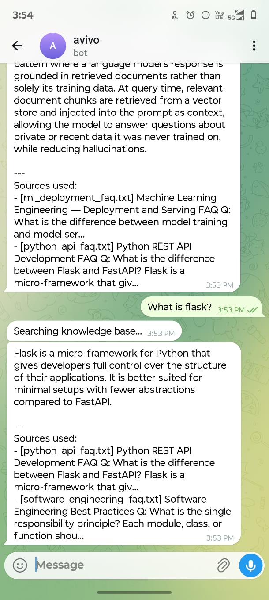

# 🤖 Avivo Assistant — GenAI Telegram RAG Bot

[](https://t.me/avivo_bot) 
*(Note: Replace `avivo_bot` in the URL above with your actual bot username if different)*

<p align="center">
  
  
</p>

A lightweight GenAI bot that answers questions from a local documentation knowledge base using a Retrieval-Augmented Generation (RAG) pipeline. Designed strictly as an on-premise, cloud-independent service. No cloud vector databases — everything runs locally.

---

## System Architecture

```
User (Telegram)
      |
      v
[Telegram Bot API]
      |
      v
[Bot Handler Layer]   <-- python-telegram-bot
  /ask  /help
      |
      v
[RAG Pipeline]
  1. Embed query         (sentence-transformers / all-MiniLM-L6-v2)
  2. Cosine retrieval    (SQLite, in-process)
  3. Build prompt
  4. LLM call            (Ollama local or OpenAI API)
      |
      v
[Response Formatter]
  + Source attribution
      |
      v
User (Telegram)
```

---

## Models Used

| Component  | Model                  | Reason                                                              |
|------------|------------------------|---------------------------------------------------------------------|
| Embeddings | `all-MiniLM-L6-v2`     | 384-dim, fast, strong semantic quality, runs on CPU                 |
| LLM        | `gpt-4o-mini` (OpenAI) | Low cost, reliable, excellent instruction following, no GPU needed |
| Alt LLM    | `mistral` via Ollama   | Local fallback — set `LLM_PROVIDER=ollama` in `.env`               |

Embeddings run locally. OpenAI is the default LLM provider. Set `LLM_PROVIDER=ollama` in `.env` to run fully offline.

---

## Setup

### 1. Prerequisites

- Python 3.10+
- An [OpenAI API key](https://platform.openai.com/api-keys)
- A Telegram bot token from [@BotFather](https://t.me/BotFather)

> To use Ollama instead, install [Ollama](https://ollama.ai), run `ollama serve`, pull a model (`ollama pull mistral`), and set `LLM_PROVIDER=ollama` in `.env`.

### 2. Install dependencies

```bash
pip install -r requirements.txt
```

### 3. Configure environment

```bash
cp .env.example .env
```

Edit `.env` and set your `TELEGRAM_BOT_TOKEN`. All other values have sensible defaults.

### 4. Run

```bash
python app.py
```

On first run, the bot will embed all documents in `data/docs/` and write them to `data/embeddings.db`. Subsequent runs skip this step.

---

## Environment Variables

| Variable            | Default                    | Description                              |
|---------------------|----------------------------|------------------------------------------|
| TELEGRAM_BOT_TOKEN  | (required)                 | Token from BotFather                     |
| LLM_PROVIDER        | `ollama`                   | `ollama` or `openai`                     |
| LLM_MODEL           | `mistral`                  | Model name for the chosen provider       |
| OLLAMA_BASE_URL     | `http://localhost:11434`   | Ollama server URL                        |
| OPENAI_API_KEY      | (empty)                    | Required only if LLM_PROVIDER=openai     |
| EMBEDDING_MODEL     | `all-MiniLM-L6-v2`         | Sentence-transformers model name         |
| DB_PATH             | `data/embeddings.db`       | SQLite database path                     |
| DOCS_DIR            | `data/docs`                | Directory containing knowledge documents |
| TOP_K               | `3`                        | Number of chunks to retrieve per query   |
| CHUNK_SIZE          | `300`                      | Words per chunk                          |
| CHUNK_OVERLAP       | `50`                       | Overlapping words between chunks         |
| MAX_HISTORY         | `3`                        | Messages to retain per user session      |

---

## Bot Commands

| Command         | Description                               |
|-----------------|-------------------------------------------|
| `/ask <query>`  | Ask a question from the knowledge base    |
| `/help`         | Show usage instructions                   |

Example:
```
/ask What is the difference between SQL and NoSQL?
/ask How does RAG work?
/ask What is rate limiting?
```

---

## Local Web UI

A browser-based chat interface for testing the RAG pipeline without a Telegram client.

```bash
pip install flask
python ui_server.py
```

Open [http://localhost:5000](http://localhost:5000) in a browser.

Features:
- Real-time query interface with animated response indicator
- Source attribution cards per response
- Session query and cache counters in the sidebar
- Health check showing active LLM provider and model

---

## Adding Knowledge Documents


Drop any `.txt` or `.md` file into `data/docs/`. Delete `data/embeddings.db` and restart the bot to rebuild the index.

---

## Project Structure

```
.
├── app.py                 # Entry point
├── config.py              # Environment configuration
├── requirements.txt
├── .env.example
├── bot/
│   ├── handlers.py        # Telegram command handlers
│   └── formatter.py       # Response formatting
├── rag/
│   ├── chunker.py         # Document splitting
│   ├── embedder.py        # Sentence-transformer wrapper
│   ├── store.py           # SQLite read/write
│   ├── retriever.py       # Cosine similarity retrieval
│   ├── pipeline.py        # Orchestration layer
│   └── llm.py             # LLM caller (Ollama / OpenAI) + cache
└── data/
    └── docs/              # Knowledge base documents
```

---

## Design Decisions

**Why SQLite instead of a vector DB?**
The knowledge base is small (under 1000 chunks). A full vector database (Pinecone, Weaviate, Chroma) adds operational overhead with no meaningful performance gain at this scale. SQLite stores vectors as JSON and cosine similarity is computed in-process with NumPy — this is fast enough and requires zero additional services.

**Why normalized embeddings?**
Normalizing vectors before storage reduces cosine similarity to a dot product, which is a single NumPy operation and avoids division at query time.

**Why a query cache?**
RAG queries with identical context produce identical answers from the LLM. Caching on a SHA-256 hash of `query + context` avoids redundant LLM calls for repeated questions — common in production bots.
